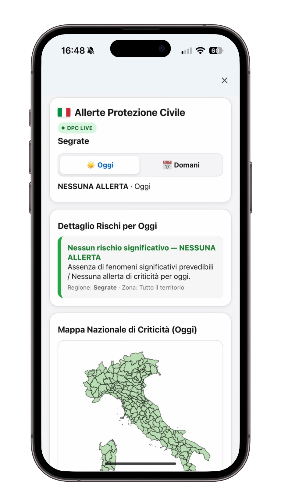

#  Italian Weather Alerts for Google AI Edge Gallery

> 🇮🇹 Leggi la versione in Italiano: [README.it.md](README.it.md)

An on-device Agent Skill for the **Google AI Edge Gallery** mobile app (available on Android & iOS) that queries official **Italian Civil Protection** emergency bulletins and displays localized risk levels and national criticality maps directly on an interactive in-chat mobile dashboard.

[](https://github.com/raythekool/edge-skill-italian-weather-alerts)
[](https://github.com/google-ai-edge/gallery)
[](https://github.com/raythekool/edge-skill-italian-weather-alerts)
[-green?style=flat-square)](https://github.com/raythekool/edge-skill-italian-weather-alerts)
[](https://github.com/raythekool/edge-skill-italian-weather-alerts)

---

## 🖼️ Mobile UI Preview

Here is how the skill appears live inside a **Google AI Edge Gallery** chat on a mobile phone (example for the municipality of **Segrate, Milan**):

<p align="center">
  
</p>

> ℹ️ Captured directly on device: decentralized fetching of official Civil Protection bulletins, interactive day toggle (Today/Tomorrow), and official cartographic alert maps.

---

## 📚 Tutorials: Getting Started with Weather Alerts

### Asking Your First Question
Once the skill is enabled, simply ask your phone in plain language:

1. **Specific municipality**:
   > *"Are there any weather alerts tomorrow in Bologna?"*
2. **Local risk details**:
   > *"What risk levels affect Milan and Lombardy today?"*
3. **Regional overview & map**:
   > *"Show me Civil Protection alerts and the national map for Tuscany."*

The on-device model automatically resolves the municipality to its official alert zone, fetches live data directly from the Civil Protection repository, and returns a clear text summary with an **interactive visual card**.

---

## 🛠️ How-To Guides: Installation & Daily Use

### ⚡ 1-Click Quick Add
[](https://raythekool.github.io/edge-skill-italian-weather-alerts/skills/italian-weather-alerts/)

**Skill URL to paste in the app:**
```text
https://raythekool.github.io/edge-skill-italian-weather-alerts/skills/italian-weather-alerts/
```

### How to Install on Your Phone (Android & iOS)
You can add this skill to the **Google AI Edge Gallery** app in 3 simple steps:

1. **Open Google AI Edge Gallery** on your Android device or iPhone.
2. In the menu, go to **Agent Skills** (or **Skill Manager**).
3. Tap **Add Skill** > **From URL** (or **Remote URL**).
4. Paste the official skill link:
   ```text
   https://raythekool.github.io/edge-skill-italian-weather-alerts/skills/italian-weather-alerts/
   ```
5. Tap **Add / Confirm**. You can now ask questions about Italian weather alerts in any chat!

---

## 📖 Reference: Prompts, Risks & Data Sources

### How the Skill is Structured
The skill follows the standard 3-tier architecture defined by the Google AI Edge Gallery specification:

```text
skills/italian-weather-alerts/
├── SKILL.md             # Agent Contract: System prompt, geo-resolution rules, and tool schemas
├── scripts/             # Headless Runner: Direct client-side DPC Open Data querying & caching
└── assets/              # Interactive UI: Responsive mobile card with alert levels & national maps
```

- **`SKILL.md` (Agent Contract)**: Instructs the local model on how to query official data and strictly forbids inventing alerts from generic forecasts.
- **`scripts/` (Headless Runner)**: Executes asynchronously in the background on device to fetch live Civil Protection GeoJSON bulletins and map municipalities to official alert zones.
- **`assets/` (Mobile Dashboard)**: Renders the touch-friendly inline card with color-coded risk levels, detailed descriptions, and national maps directly inside the chat.

### Example Prompts
- *"Are there any flood or rain alerts in Genoa today?"*
- *"Show me thunderstorm warnings for tomorrow in Rome."*
- *"What is the alert level in Florence right now?"*
- *"Display the national Civil Protection map for tomorrow."*

### Official Alert Levels
- 🟢 **Green (Verde)**: Absence of significant predictable criticality.
- 🟡 **Yellow (Giallo)**: Ordinary criticality (localized flooding, sudden severe storms, minor landslides).
- 🟠 **Orange (Arancione)**: Moderate criticality (widespread, hazardous, and prolonged weather events).
- 🔴 **Red (Rosso)**: High criticality (severe and extensive danger to public safety).

### Covered Risk Categories
- **Hydrogeological (Idrogeologico)**: Landslides, mudslides, and runoff caused by heavy rainfall.
- **Hydraulic (Idraulico)**: River flooding, watercourse overflow, and structural bank failures.
- **Severe Thunderstorms (Temporali)**: Rapid, violent convective storms with hail and wind gusts.

### Official Authoritative Sources
All data is ingested directly from the official open-data repositories published daily by the **Italian Department of Civil Protection (DPC)**:
- Open Data Repository: [`pcm-dpc/DPC-Bollettini-Criticita-Idrogeologica-Idraulica`](https://github.com/pcm-dpc/DPC-Bollettini-Criticita-Idrogeologica-Idraulica)
- Official DPC Maps: [Mappe Rischi Protezione Civile](https://mappe.protezionecivile.gov.it/it/mappe-rischi/bollettino-di-criticita/)

---

## 🧠 Explanation: Why Official Bulletins & Zero-Backend?

### 1. Official Safety Bulletins vs Standard Weather Forecasts
Commercial weather forecast apps predict rainfall probability, but they do not reflect institutional risk levels. This skill connects directly to the **official emergency alerts** issued by regional and national authorities, ensuring you receive authoritative, verified public safety data.

### 2. Zero-Backend & Complete Privacy
This skill does not rely on third-party tracking servers or proprietary APIs:
- Your queries and locations remain private on your device.
- The phone fetches raw government open data directly from GitHub and resolves municipal zones locally.

### 3. Strict Anti-Hallucination Policy
The AI model is strictly prohibited from guessing or fabricating alert zones or risk levels. If data is unavailable or stale, it reports this transparently rather than inventing an answer.

---

## ⚠️ Disclaimer
*This project is an independent technical tool and is not an emergency dispatch or official broadcast service. In case of severe weather or emergency, always consult the official Civil Protection channels and follow local municipal instructions.*
