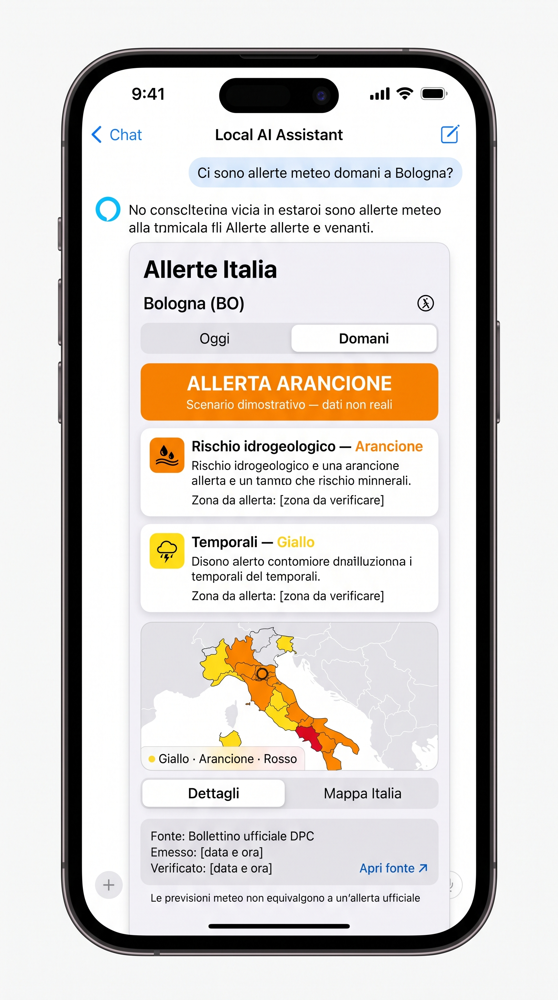

# 🇮🇹 Italian Weather Alerts for Google AI Edge Gallery

> A Google AI Edge Gallery skill for querying official Italian Civil Protection weather alerts and presenting the results in a clear, visual mobile dashboard.

## ✨ Overview

This project is a prototype Agent Skill for [Google AI Edge Gallery](https://github.com/google-ai-edge/gallery). It is designed to answer questions such as:

- “Are there any weather alerts tomorrow in Bologna?”
- “What risks affect my area today?”
- “Show me the current Civil Protection alerts for my location.”

The skill will cover the whole of Italy, resolve locations to official alert zones, and return both a concise AI answer and an interactive visual dashboard.

## 🖼️ UI mockup

The following mockup illustrates the intended response experience inside an Edge Gallery chat:

> ⚠️ The alerts shown in the mockup are fictional and for design purposes only. They must never be interpreted as live official information.

## 🎯 Main goals

- 🇮🇹 Support all Italian regions and autonomous provinces.
- 🗺️ Map municipalities and locations to official Civil Protection alert zones.
- 🚦 Clearly display yellow, orange, and red alert levels.
- 🌧️ Separate hydrogeological, hydraulic, thunderstorm, and other supported risks.
- 📅 Support at least today and tomorrow.
- 🔎 Show bulletin issue time, retrieval time, source, and data freshness.
- 📱 Provide a mobile-friendly inline visual dashboard.
- ♿ Use text, labels, icons, and patterns in addition to colors.
- 🛡️ Never infer an official alert from a generic weather forecast.

## 🧱 Planned architecture

1. A scheduled GitHub Actions workflow retrieves and normalizes official public data.
2. A compact national JSON snapshot is published for the skill to query.
3. The Edge Gallery JavaScript skill filters the snapshot by location and date.
4. The skill returns structured data plus an inline HTML dashboard.
5. The interface provides detail cards, an Italy map, source metadata, and stale-data warnings.

## 📚 Data principles

- Official Civil Protection alert levels are authoritative.
- Weather forecasts and official alerts are displayed as different data types.
- Missing, stale, ambiguous, or unavailable data must be reported explicitly.
- The AI must not invent alert zones, levels, dates, issue times, or risk categories.

## 🚧 Project status

This repository currently contains the concept documentation and visual prototype. The ingestion pipeline, national zone mapping, Edge Gallery skill implementation, automated tests, and deployment workflow will be added incrementally.

See [Implementation evolution](docs/implementation-evolution.md) for the proposed roadmap.

## ⚠️ Disclaimer

This project is a personal technical prototype and is not an emergency notification service. Always consult official Civil Protection and regional authorities for current information and follow official emergency instructions.
